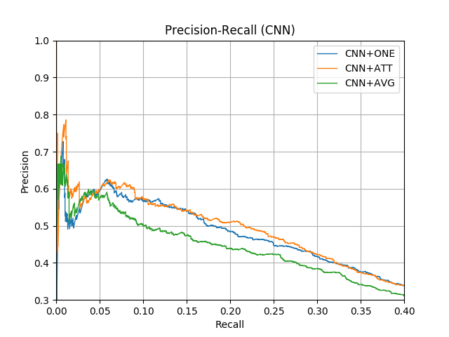
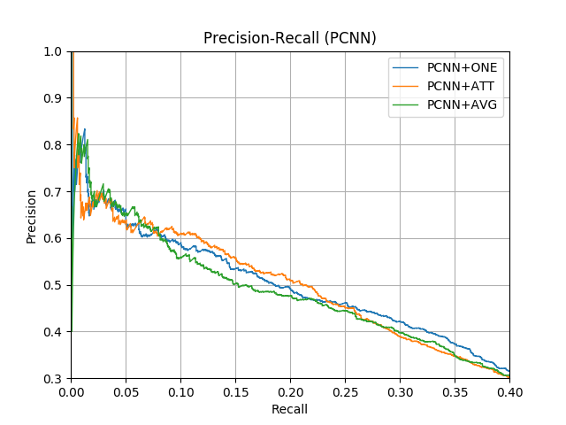

# distant-supervised-relation-extraction
Implementation of [Neural Relation Extraction with Selective Attention over Instances](https://www.aclweb.org/anthology/P16-1200.pdf).

## Environment Requirements
* python 3.6
* pytorch 1.3.0
* gensim 3.8.0
* matplotloib 3.1.2
* sklearn 0.21.3

## Data
* [NYT10](https://raw.githubusercontent.com/thunlp/NRE/master/data.zip)

## Usage
1. Download the `NYT10` and decompress it in the current directory.
2. Preprocess the original data, and the processed data is stored in `processed` folder.
```shell
python preprocess.py
```
3. You can use the following the commands to start the program.
```shell
python run.py --encoder='cnn' --selector='one'
python run.py --encoder='cnn' --selector='att'
python run.py --encoder='cnn' --selector='avg'
python run.py --encoder='pcnn' --selector='one'
python run.py --encoder='pcnn' --selector='att'
python run.py --encoder='pcnn' --selector='avg'
```

More details can be seen by `python run.py -h`.

4. You can use run the `draw.py` to visualize the results.
```shell
python draw.py
```

## Result
The results of my version are present as follows:




*Note*:
* Some settings may be different from those mentioned in the paper.
* No validation set used during training.
* Some errors exists in my code, but on the whole it is right.
* If you have any suggestions, please ***Issue***.


## Reference Link
* https://github.com/thunlp/NRE
* https://github.com/thunlp/OpenNRE

